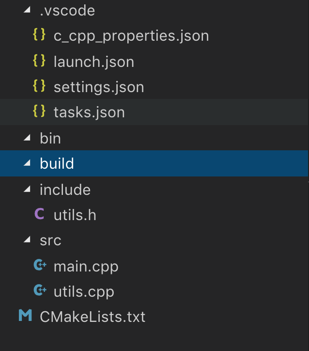
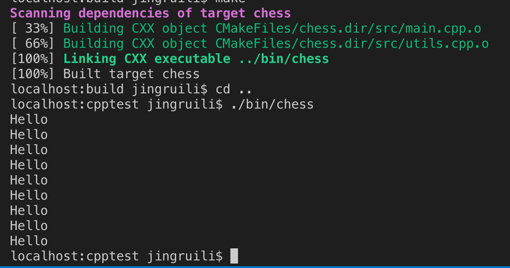

# VS Code + Cmake + CppUnit 搭建大型C++工程(一)(单元测试在第二篇添加)

本文介绍了以VS Code编辑器为核心, 用cmake编译, 配合gdb进行调试, cppunit进行单元测试(单元测试在第二篇添加)的大型C++工程最佳实践. (配置环境为WSL, Ubuntu和MacOS)  
本文所有源码可在[Github](https://github.com/1079805974/CppProjectTemplate)下载.
## 总工程概览
```text
Project:
│ 
├── bin                  可执行文件夹 
│   └── test             测试文件夹
├── build                cmake缓存目录 
├── include              头文件目录
│   └── utils.h
├── make                 bash脚本
├── readme.md            本文
├── src                  源文件目录
│   ├── main.cpp     
│   └── utils.cpp    
├── test                 单元测试目录
│   ├── CMakeLists.txt   子目录 CMakeLists
│   ├── main.cpp
│   ├── test.h
│   └── utils_test.cpp
└── CMakeLists.txt       主目录 CMakeLists
```

## 新建工程目录
新建工程目录, 用`VS Code`打开, 我的命名为 `CppTest`.  
执行下列命令, 构建工程的基本框架: 
```bash
mkdir .vscode bin build include src  
cd ../src
touch main.cpp utils.cpp
cd ..
touch include/utils.h

```
创建`VS Code`配置文件
```bash
cd ../.vscode
touch c_cpp_properties.json launch.json settings.json          tasks.json
```

## 安装cmake
cmake是一个跨平台的安装(编译)工具, 可以用简单的语句来描述所有平台的安装(编译过程).

Ubuntu下安装 :  
```bash
sudo apt-get install cmake
```
MacOS:
```bash
brew install cmake
```
测试安装:
```bash
cmake --version
#OUTPUT :cmake version 3.11.2
```

`cmake` 所需的主要文件就是 `CMakeLists.txt`, 我们可以通过编写`CMakeLists.txt` 调用 `gcc` 等编译器, 省去了每次输入冗长命令的麻烦.

## 第一个CMakeLists.txt
打开主目录下的 `CMakeLists.txt`, 写入如下内容(Github上有无注释版本):
### ./CMakeLists.txt

```cmake
CMAKE_MINIMUM_REQUIRED(VERSION 2.8) # cmake最低版本要求

PROJECT(CppTemplate)    # 工程名 CppTemplate

set(CMAKE_CXX_FLAGS "${CMAKE_CXX_FLAGS} -std=c++11") # 添加c++11标准支持

SET(CMAKE_C_COMPILER "/usr/bin/gcc") # 默认c编译器
SET(CMAKE_CXX_COMPILER "/usr/bin/g++") # 默认c++编译器

SET(CMAKE_BUILD_TYPE "Debug")  # Debug模式 选项: Release Debug MinSizeRel RelWithDebInfo

SET(CMAKE_CXX_FLAGS_DEBUG "$ENV{CXXFLAGS} -O0 -Wall -g2 -ggdb")  # debug模式下 gdb相关选项
SET(CMAKE_CXX_FLAGS_RELEASE "$ENV{CXXFLAGS} -O3 -Wall") # release模式下 gdb相关选项

# set(CMAKE_VERBOSE_MAKEFILE ON) # 开启调试 出现问题时开启

# enable_testing() # 打开测试

add_definitions(-DDEBUG) # 相当于代码中 #define DEBUG

# add_subdirectory(test) # 添加test子目录

SET(EXECUTABLE_OUTPUT_PATH "${PROJECT_SOURCE_DIR}/bin") # 可执行文件输出目录
  
INCLUDE_DIRECTORIES("${PROJECT_SOURCE_DIR}/include") # 头文件包含目录

# 这段代码可以区分操作系统
MESSAGE("Identifying the OS...")
if(WIN32)
  MESSAGE("This is Windows.")
elseif(APPLE)
  MESSAGE("This is MacOS.")
elseif(UNIX)
  MESSAGE("This is Linux.")
endif()
# 这段代码可以区分操作系统

AUX_SOURCE_DIRECTORY(src DIR_SRCS) # 添加源代码文件夹, 自动扫描所有文件

add_executable(chess  # 输出名为chess的可执行文件
   ${DIR_SRCS}
)
# 也可以这么写
# add_executable(chess  # 输出名为chess的可执行文件
#    ./src/main.cpp
#    ./src/utils.cpp
# )
```

## 编写主程序

### ./src/main.cpp
```cpp
#include "utils.h"

using namespace std;

int main(int argc, char const* argv[]) {
    for(int i=0;i<9;i++){
        cout << "Hello" << endl;
    }
     return 0; 
}
```
### ./src/utils.cpp 
```cpp
#include "utils.h"
//单元测试时编写
```
### ./include/utils.cpp
```cpp
#pragma once
#include <iostream>
//单元测试时编写
```

## 编译执行
至此, 我们工程的目录结构如下:


打开 `VS code` 终端, 执行: 
```bash
cd build 
cmake ..  #生成Makefile
make   #编译
```
如果一切正常, bin目录下就会多出一个chess可执行文件.  
```bash
cd ..
./bin/chess
```
效果如图:

如果出错也没关系, 可以删掉 `CMakeLists.txt` 的 `# set(CMAKE_VERBOSE_MAKEFILE ON)` 注释, 并运行:
```
cd build
cmake .. > cmake.out
```
就可以打开 `build` 目录下的 `cmake.out` 查看调试信息.
## 基本完成
至此, 你已经完成了基本项目的构建, 可以随意修改代码, 只要运行
```bash
cd build 
cmake ..  #生成Makefile
make   #编译
```
就可以生成你的文件了.

可以按照我的另一篇文章 <a target="_blank" href="https://zhuanlan.zhihu.com/p/44337349">用VSCode调试C/C++代码 </a> 来进行调试.


感谢您的阅读. 欢迎点赞哦~