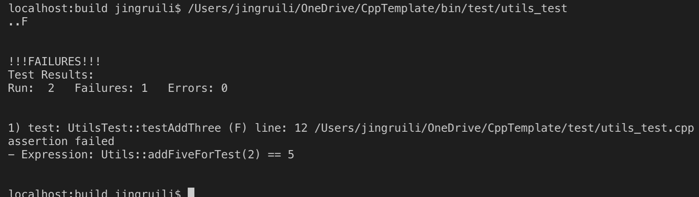

# VS Code + Cmake + CppUnit 搭建大型C++工程(二)(单元测试添加)

本文介绍了以VS Code编辑器为核心, 用cmake编译, 配合gdb进行调试, cppunit进行单元测试的大型C++工程最佳实践. (配置环境为WSL, Ubuntu或MacOS)  
本文所有源码可在 [https://github.com/1079805974/CppProjectTemplate](https://github.com/1079805974/CppProjectTemplate) 下载.
## 总工程概览
```text
Project:
│ 
├── bin                  可执行文件夹 
│   └── test             测试文件夹
├── build                cmake缓存目录 
├── include              头文件目录
│   └── utils.h
├── make                 bash脚本
├── readme.md            本文
├── src                  源文件目录
│   ├── main.cpp     
│   └── utils.cpp    
├── test                 单元测试目录
│   ├── CMakeLists.txt   子目录 CMakeLists
│   ├── main.cpp
│   ├── test.h
│   └── utils_test.cpp
└── CMakeLists.txt       主目录 CMakeLists
```

## 创建test目录
用 `VS Code` 打开之前工程的文件夹, 执行下列命令, 创建测试文件夹: 
```bash
mkdir test  
cd test
touch CMakeLists.txt  main.cpp test.h utils_test.cpp
cd ..
```

## 安装CppUnit
CppUnit是由JUnit移植过来的一个在GNU LGPL条约下的并在sourcefogre网站上开源的C++单元测试框架。

Ubuntu下安装 :  
进入[https://sourceforge.net/projects/cppunit/files/cppunit/](https://sourceforge.net/projects/cppunit/files/cppunit/), 下载最新版本的cppunit, 解压.  
在 `cppunit-1.12.1` 目录下运行
```bash
./configure
make
make install
```
MacOS:
```bash
brew install cppunit
```

## 修改CMakeLists.txt
打开主目录下的 `CMakeLists.txt`, 去掉这两行的注释.
```cmake
enable_testing() # 打开测试

add_subdirectory(test) # 添加test子目录
```
打开test下的 `CMakeLists.txt`, 写入如下内容(Github上有无注释版本):
### ./test/CMakeLists.txt
```cmake

# 这段代码可以区分操作系统
MESSAGE("Identifying the OS...")
if(WIN32)
  MESSAGE("This is Windows.")
elseif(APPLE)
  MESSAGE("This is MacOS.")
  INCLUDE_DIRECTORIES("/usr/local/Cellar/cppunit/1.14.0/include/")
elseif(UNIX)
  MESSAGE("This is Linux.")
endif()
# 这段代码可以区分操作系统

AUX_SOURCE_DIRECTORY("${PROJECT_SOURCE_DIR}/test" DIR_TESTS)
set(SRC "${PROJECT_SOURCE_DIR}/src" )

INCLUDE_DIRECTORIES("${PROJECT_SOURCE_DIR}/include")

SET(EXECUTABLE_OUTPUT_PATH "${PROJECT_SOURCE_DIR}/bin/test")

add_executable(utils_test
  ${SRC}/utils.cpp
  ${DIR_TESTS}
)

target_link_libraries(
  utils_test
  cppunit
  ${CMAKE_DL_LIBS}
)

ADD_TEST(NAME utils_test COMMAND "${PROJECT_SOURCE_DIR}/bin/test/utils_test")
set_tests_properties (utils_test
PROPERTIES FAIL_REGULAR_EXPRESSION "failed") 
```

## 编写主程序

### ./test/main.cpp
```cpp
#include <cppunit/extensions/TestFactoryRegistry.h>
#include <cppunit/ui/text/TestRunner.h>

#include "test.h"

int main()
{
    CPPUNIT_TEST_SUITE_REGISTRATION( UtilsTest );
    CppUnit::TextUi::TestRunner runner;

    CppUnit::TestFactoryRegistry &registry = CppUnit::TestFactoryRegistry::getRegistry();
    
    runner.addTest(registry.makeTest());
    runner.run();
}
```
### ./test/utils_test.cpp 
```cpp
#include <cppunit/extensions/HelperMacros.h>
#include <iostream>
#include <cstring>

#include "test.h"
#include "utils.h"
using namespace std;

void UtilsTest::testAddFive() {
  CPPUNIT_ASSERT(Utils::addFiveForTest(2)==7);
}

void UtilsTest::testAddThree() {
  CPPUNIT_ASSERT(Utils::addThree(2)==5);
}

```
### ./test/test.h
```cpp
#pragma once

#include <cppunit/extensions/HelperMacros.h>

class UtilsTest : public CppUnit::TestFixture {
   CPPUNIT_TEST_SUITE( UtilsTest );
   CPPUNIT_TEST( testAddFive );
   CPPUNIT_TEST( testAddThree );
   CPPUNIT_TEST_SUITE_END();
 public:
    UtilsTest(){}  
    void setUp(){};  
    void tearDown(){};  
    void testAddFive();
    void testAddThree();
 };

```

### ./include/utils.h
```cpp
#pragma once
#include <iostream>

class Utils {
 friend class UtilsTest;
 public:
  static int addFiveForTest(int num);
  static int addThree(int num);
};

```

### ./src/utils.h
```cpp
#include "utils.h"

int Utils::addFiveForTest(int num){
  return num + 5;
}
int Utils::addThree(int num){
  return num - 3;  //故意写错
}
```

## 编译执行
打开 `VS code` 终端, 执行: 
```bash
cd build 
cmake ..  #生成Makefile
make   #编译
```
执行测试
```bash
ctest -V
```
效果如图:

可以看到两个测试, 失败一个, 失败在 `Utils::addThree(2) == 5` 这个断言, 说明我们的 `addThree` 函数有问题.

## src/utils.cpp: addThree
```cpp
int Utils::addThree(int num){
  return num - 3;
}
```

可以按照我的另一篇文章 <a target="_blank" href="https://zhuanlan.zhihu.com/p/44337349">用VSCode调试C/C++代码 </a> 来进行调试.


感谢您的阅读. 欢迎点赞哦~